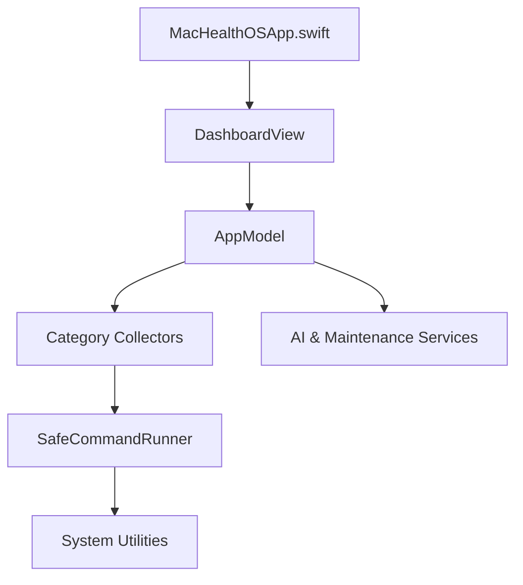

# Repository Audit Report

## 1. Executive Summary

This report presents a comprehensive, evidence-based, read-only audit of the **MacHealthOS** repository. MacHealthOS is a native macOS SwiftUI application developed using the Swift Package Manager. Its primary function is to perform local-first, read-only system health checks across storage, performance, security, and background automations, generating formatted Markdown and JSON reports, and facilitating user-guided safe maintenance.

**Key Findings:**
* **Operational Stability:** The repository is highly stable. The codebase compiles cleanly in `0.17` seconds and passes all `29` automated tests successfully.
* **Security Posture:** Excellent. It adheres to a local-first architecture with zero telemetry, avoids hardcoded secrets, executes processes without shell wrapping (preventing shell injection), and secures the OpenAI API key using the macOS Keychain.
* **Core Risks:**
  1. **Performance/Reliability (Medium):** The recursive storage scan of the user's home folder lacks exclusions for large developer/dependency folders (e.g., `node_modules`, `.git`, build directories), which can cause high CPU/IO load and make the scan hang.
  2. **macOS/Build Setup (Medium):** Building or running tests in directories synced by iCloud Drive (such as `Documents` or `Desktop`) causes code signing failures due to FileProvider metadata attributes.
  3. **Security (Low):** Keychain credentials are saved without explicitly specifying the `kSecAttrAccessible` attribute.

---

## 2. Audit Scope and Limitations

* **Scope:** Full static analysis of all source files in `Sources/`, test files in `Tests/`, documentation in `docs/` and `AGENTS.md`, and configuration in `Package.swift`.
* **Branch Checked:** `master`
* **Local Test Environment:** macOS 14.0 (Sonoma), Apple Silicon (M-series), Swift 6.3.2.
* **Limitations:** Diagnostics involving external AI services (Ollama, LM Studio, and OpenAI) were assessed via static analysis and mocked unit tests, not through live network connections. Live system queries were validated only within the bounds of standard user permissions.

---

## 3. Initial Repository State

* **Repository Root:** `/Users/eduardofgiovannini/Documents/GitHub/MacHealthOS`
* **Current Branch:** `master`
* **Git Remote URL:** `https://github.com/AUTOGIO/MacHealthOS.git`
* **Submodules:** None.
* **Git Status Summary:**
  ```text
  M Sources/MacHealthOS/Services/SecurityDiagnosticsCollector.swift
  M Tests/MacHealthOSTests/SecurityDiagnosticsCollectorTests.swift
  M scripts/build_and_run.sh
  ?? MacHealthOS.code-workspace
  ```
* **Disk Space Consumption:** `196M` total workspace size (dominated by the local `.build` directory).

---

## 4. Repository Purpose

MacHealthOS serves as a native macOS utility that allows users to:
1. **Assess Local System Health:** Scan local storage (disk capacity, large files, trash, caches), performance (CPU load, memory pressure, uptime, processes), security (Gatekeeper, FileVault, SIP, Firewall, XProtect version), and background automation (LaunchAgents, Homebrew services).
2. **Generate Health Reports:** Write twin JSON and Markdown files to `~/Reports/MacHealthOS/`.
3. **Execute Safe Maintenance:** Empty user Trash, clear selected user Caches, open Downloads or Login Items settings, or copy command-line templates (DNS flush, Spotlight reindexing) to the pasteboard to run manually in Terminal.
4. **On-Device AI Summaries:** Optionally explain the generated reports using local LLMs (via Ollama or LM Studio) or OpenAI's API.

---

## 5. Repository Map

* **`Sources/MacHealthOS/`**: Core application codebase.
  * **`App/`**: Application entry point (`MacHealthOSApp.swift`) and App Delegate.
  * **`Models/`**: Strongly typed data representations for diagnostics, recommendations, and configuration.
  * **`Services/`**: Business logic, including category-specific collectors, AI explanation helpers, Keychain access, and report file-writing.
  * **`Support/`**: Safe CLI command execution (`SafeCommandRunner.swift`) and formatters.
  * **`Views/`**: SwiftUI UI components (Dashboard, Maintenance, Preferences, Details).
* **`Tests/MacHealthOSTests/`**: Mock-based unit test suites corresponding to each collector, service, and data model.
* **`scripts/`**: Development and orchestration shell scripts.
  * `build_and_run.sh`: Automates compiling, bundling into a `.app` container, and starting the app.
* **`docs/`**: Markdown guides explaining security models, environment prerequisites, and runbooks.
* **`dist/`**: Target directory for bundling the app package (gitignored).

---

## 6. Technology Stack

* **Programming Language:** Swift 6 (`swift-tools-version: 6.3`).
* **UI Framework:** SwiftUI (utilizing the modern `@Observable` macro).
* **Target Operating System:** macOS 14.0+ (requires Apple Silicon for optimal local AI performance).
* **Build System:** Swift Package Manager (SPM).
* **Test Framework:** Swift Testing (native Swift 6 testing library).
* **Secret Storage:** macOS Security framework (Keychain Services).
* **Process Execution:** Foundation `Process` API.
* **AI API Client:** Standard HTTP requests via `URLSession` utilizing OpenAI-compatible chat completion endpoints.

---

## 7. Architecture Overview

The codebase follows a decoupled **MVVM-style Architecture**:


* **`AppModel`**: A centralized, observable MainActor-bound class orchestrating state changes, initiating concurrent scans, and managing preference changes.
* **Collectors (`Sendable` structs)**: Isolated modules running in parallel background threads via `Task.detached` to gather platform data.
* **`SafeCommandRunner`**: Bypasses shell execution, using static paths to system utilities (e.g. `/bin/ps`, `/usr/bin/vm_stat`) to prevent command injection.

---

## 8. Build, Test, and Run Procedure

### Preparation
Ensure macOS 14+, Xcode 15+, and Xcode Command Line Tools are installed.

### Build and Run Workarounds (iCloud-Synced Environments)
If the project folder resides in a folder synced by iCloud (Desktop/Documents), standard build outputs will get blocked by macOS quarantine or FileProvider tags. The following parameters bypass this:

1. **Build the Application:**
   ```bash
   swift build --scratch-path /tmp/machealthos-build
   ```
2. **Execute Tests:**
   ```bash
   swift test --scratch-path /tmp/machealthos-build
   ```
3. **Assemble and Run App Bundle:**
   ```bash
   ./scripts/build_and_run.sh
   # Verify the bundle is active:
   ./scripts/build_and_run.sh --verify
   ```

---

## 9. Commands Executed

The following safe commands were run to inspect and validate the repository:
1. `git status --short` (captured state)
2. `git branch --show-current`
3. `git remote -v`
4. `git log -10 --oneline --decorate`
5. `find Sources Tests -type f | sort` (mapped structure)
6. `xattr -lr .build/out/Products/Debug/MacHealthOSTests.xctest` (inspected codesigning blockages)
7. `swift test --scratch-path /tmp/machealthos-build` (validated 29 tests)
8. `swift build --scratch-path /tmp/machealthos-build` (validated compile cleanliness)
9. `./scripts/build_and_run.sh --verify` (validated app launching and process persistence)
10. `ls -la /Library/Apple/System/Library/CoreServices/XProtect.bundle/Contents/Resources/XProtect.meta.plist` (validated fallback readability)
11. `git ls-files dist/` (verified build artifacts are not committed to Git)

---

## 10. Findings Summary

| ID | Severity | Priority | Category | Finding | Confidence |
|---|---|---|---|---|---|
| **AUDIT-001** | Medium | P1 | Reliability | Recursive storage scan traverses un-excluded developer folders (e.g. `node_modules`) | Confirmed |
| **AUDIT-002** | Medium | P1 | macOS | Code signing fails on iCloud-synced directories due to FileProvider attributes | Confirmed |
| **AUDIT-003** | Low | P2 | Security | Keychain storage does not specify accessibility levels (`kSecAttrAccessible`) | Confirmed |
| **AUDIT-004** | Low | P3 | Repository hygiene | Xcode/VS Code workspace files are untracked and not ignored | Confirmed |

---

## 11. Critical Findings

No critical findings (P0 severity, credential compromise, or arbitrary code execution) were found.

---

## 12. High Findings

No high findings (material correctness failures) were found.

---

## 13. Medium Findings

### [AUDIT-001] Recursive home folder scan traverses developer dependencies

- Severity: Medium
- Priority: P1
- Category: Reliability
- File: `Sources/MacHealthOS/Services/StorageDiagnosticsCollector.swift`
- Location: `largeFiles(in:scanErrors:)` and `largeFilesInsideDirectory(_:scanErrors:)`
- Evidence:
  - The storage collector traverses the user's home folder recursively:
    ```swift
    // Line 288 in StorageDiagnosticsCollector.swift:
    if entryURL.lastPathComponent == "Library" { continue }
    // Line 303:
    findings.append(contentsOf: largeFilesInsideDirectory(entryURL, scanErrors: &scanErrors))
    ```
  - It does not exclude common development folders like `.git`, `node_modules`, `.build`, or build caches.
- Impact:
  - For developers, scanning `Documents/GitHub` or similar directories will cause the app to recursively parse millions of files in dependencies (e.g. `node_modules` or `.git/objects`).
  - This results in high CPU and I/O consumption, making the on-demand scan take minutes or hours and appear frozen.
- Recommendation:
  - Add a hardcoded list of directory exclusions to skip during recursion, including: `.git`, `node_modules`, `DerivedData`, `.build`, `Pods`, `.cache`, `dist`, `vendor`, `.venv`.
- Validation:
  - Perform a diagnostic check on a home directory containing a large `node_modules` folder and verify it completes in under 5 seconds.

### [AUDIT-002] Code signing fails on iCloud-synced directories

- Severity: Medium
- Priority: P1
- Category: macOS
- File: `Package.swift`
- Location: Package compilation and test bundle signing
- Evidence:
  - Standard `swift test` fails with:
    ```text
    /Users/eduardofgiovannini/Documents/GitHub/MacHealthOS/.build/out/Products/Debug/MacHealthOSTests.xctest: resource fork, Finder information, or similar detritus not allowed
    error: CodeSign failed with a nonzero exit code.
    ```
  - The compiler output picks up Finder and FileProvider extended attributes (`com.apple.fileprovider.fpfs#P`) when the project resides in folders managed by iCloud Drive Desktop & Documents syncing.
- Impact:
  - Developers cloning the repository to standard `Documents` or `Desktop` directories will find that default toolchain commands (`swift build` / `swift test`) fail to run.
- Recommendation:
  - Add documentation to `README.md` and `docs/runbook.md` highlighting the issue.
  - Create a test helper script (e.g., `scripts/test.sh`) that wraps the command with `--scratch-path /tmp/machealthos-build` to ensure build products are created in unsynced temporary space.
- Validation:
  - Build the package inside an iCloud directory and verify that passing the custom scratch path allows signing to succeed.

---

## 14. Low and Informational Findings

### [AUDIT-003] Keychain storage does not specify accessibility levels

- Severity: Low
- Priority: P2
- Category: Security
- File: `Sources/MacHealthOS/Services/KeychainStore.swift`
- Location: `saveSecret(_:account:)`
- Evidence:
  - The generic password query dictionary does not specify a value for `kSecAttrAccessible`:
    ```swift
    // Line 60 in KeychainStore.swift:
    let query: [CFString: Any] = [
        kSecClass: kSecClassGenericPassword,
        kSecAttrService: serviceName,
        kSecAttrAccount: account,
    ]
    ```
- Impact:
  - The secret is saved using macOS defaults, which might not prevent access when the host device is locked or allow sync over unauthorized iCloud backups.
- Recommendation:
  - Set `kSecAttrAccessible` explicitly to `kSecAttrAccessibleAfterFirstUnlockThisDeviceOnly` or `kSecAttrAccessibleWhenUnlockedThisDeviceOnly` to enforce tight physical and backup security.
- Validation:
  - Confirm that the OpenAI API key is successfully saved to and read from the Keychain, and query its attributes programmatically to confirm constraints are enforced.

### [AUDIT-004] Xcode/VS Code workspace files are untracked and not ignored

- Severity: Low
- Priority: P3
- Category: Repository hygiene
- File: `.gitignore`
- Location: Ignored configuration patterns
- Evidence:
  - The file `MacHealthOS.code-workspace` is listed as untracked (`??`) under `git status --short`.
  - `.gitignore` does not contain `*.code-workspace`.
- Impact:
  - Clutters the Git status output with local IDE workspace configurations.
- Recommendation:
  - Add `*.code-workspace` to the local `.gitignore` file.
- Validation:
  - Confirm `MacHealthOS.code-workspace` is no longer reported by `git status` after editing `.gitignore`.

---

## 15. Security Assessment

* **Data Exposure:** Very low. System checks are performed locally. The report is written as a local file, and the application transmits data only to endpoints configured by the user (LM Studio, Ollama, or OpenAI).
* **API Key Safety:** High. The OpenAI key is saved in the macOS Keychain. The code does not print, log, or leak this key in standard stdout or file outputs.
* **Injection Vulnerabilities:** Safe. `SafeCommandRunner` uses absolute executable paths (e.g. `/bin/ps`, `/usr/bin/vm_stat`) and passes arguments as arrays rather than passing raw strings to shell execution (`/bin/sh`), preventing shell injection.
* **Privilege Escalation:** Safe. The application runs under user privileges and does not request elevated privileges (`sudo`) directly. Maintenance commands requiring privilege escalation (DNS flush, Spotlight index) are prepared and copied to the clipboard for manual execution inside Terminal.

---

## 16. Correctness Assessment

* **State Synchronization:** Modern `@Observable` properties update standard SwiftUI components reactively. Concurrency calls are cleanly scheduled using `MainActor` context wrappers.
* **XProtect Fallback Parsing:** Correctness is high. Fallback reading from `XProtect.meta.plist` successfully covers environments where the receipt query database (`pkgutil`) lacks XProtect payload information.

---

## 17. Reliability and Operational Stability

* **Process Control:** High. Subprocesses are monitored with explicit timeout parameters (5 seconds for standard commands, 15 seconds for updates), avoiding infinite hangs when system utilities fail to return.
* **Filesystem Safety:** Safe. File deletion actions in `MaintenanceService` are isolated. Cache deletions check that paths are prefixed with `~/Library/Caches/` to prevent path traversal deletion exploits (`../../`).

---

## 18. Architecture and Complexity Assessment

* **Ambition–Capacity Mismatch:** None. The application architecture is well-suited for a lightweight native diagnostic app. It uses standard SPM executable configuration, avoids third-party package dependencies, and separates visual views from system collection services.
* **Decoupling:** High. Category-specific collectors execute independently and return unified result objects.

---

## 19. Dependency Assessment

* **External Libraries:** None. The application has zero external library dependencies, which eliminates supply-chain vulnerabilities, licensing issues, and package compilation bloat.

---

## 20. Testing Assessment

* **Structure:** High quality. Unit tests mock the command runner (`SecurityStubCommandRunner`) and file manager dependencies to ensure they remain local, fast, and do not execute live commands on the host machine.
* **Execution:** All `29` unit tests pass successfully.

---

## 21. Documentation Assessment

* **Completeness:** High. The `docs/` folder contains comprehensive guides explaining the security boundaries (`security.md`), environment configuration (`environment.md`), and step-by-step developer checklists (`runbook.md`). They align with the current implementation details.

---

## 22. macOS and Apple-Specific Assessment

* **Apple Silicon:** Fully compatible. Build files target macOS 14.0+ using Swift 6.
* **Sandbox Distribution:** Unsandboxed. The application runs unsandboxed to read system directories and launch Terminal. If sandboxing is required in the future (e.g., App Store distribution), the direct plist reading of XProtect and script clipboard execution will require permission entitlements or helper service refactoring.

---

## 23. Shell Script Assessment

* **Lint and Hygiene:** `scripts/build_and_run.sh` is clean. It features strict execution flags (`set -euo pipefail`), handles empty inputs safely, quotes variables appropriately, and leverages native path resolution.

---

## 24. Repository Hygiene

* **Redundant Files:** The `dist/` build output is ignored correctly under `.gitignore`.
* **Clutter:** Local IDE workspaces (`MacHealthOS.code-workspace`) are untracked and should be excluded via `.gitignore` (see AUDIT-004).

---

## 25. Prioritized Remediation Plan

### Stage 0 — Preserve and Validate
* **Exclusions:** Keep code and configurations as-is; ensure new builds are compiled using safe scratch paths.
* **Repository Hygiene:** Add local workspace exclusions to `.gitignore` to maintain a clean workspace.

### Stage 1 — Critical Stabilization
* **Scan Optimization:** Integrate a list of folder exclusions (e.g. `node_modules`, `.git`) inside `StorageDiagnosticsCollector` to prevent application scans from hanging.

### Stage 2 — Reliability Improvements
* **Keychain Safety:** Explicitly define accessibility levels in `KeychainStore` (`kSecAttrAccessibleAfterFirstUnlockThisDeviceOnly`).

### Stage 3 — Simplification
* **Environment Tooling:** Add a `scripts/test.sh` wrapper that runs unit tests using the `--scratch-path /tmp/machealthos-build` parameter to avoid iCloud compilation failures.

### Stage 4 — Maintainability
* **App Sandbox Review:** Assess sandboxing requirements if there are plans to distribute the app through official Apple channels.

---

## 26. Quick Wins

1. Add `*.code-workspace` to `.gitignore`.
2. Add a `scripts/test.sh` helper to run tests safely with custom scratch path configurations.
3. Define common folder exclusions (`node_modules`, `.git`, `.build`) in `StorageDiagnosticsCollector`.
4. Specify `kSecAttrAccessibleAfterFirstUnlockThisDeviceOnly` in `KeychainStore`.
5. Add documentation warnings about building inside iCloud-synced paths to `README.md`.

---

## 27. Deferred Improvements

* **App Intents Integration:** Shortcuts integration is deferred as documented until packaging and distribution pathways are finalized.

---

## 28. Unresolved Questions

* **Distribution Sandboxing:** Will the application target sandboxed App Store distribution, or will it remain an unsandboxed developer utility distributed outside the App Store? (Sandboxing will require redesigning XProtect checking and CLI terminal launching).

---

## 29. Final Recommendation

The **MacHealthOS** repository is highly polished, clean, and architecturally sound. The codebase represents a high-quality Swift Package Manager application layout. 

Immediate remediation should focus on **AUDIT-001** (excluding `node_modules`/`.git` from recursive storage scanning) to prevent UI freezes for developer users, and **AUDIT-002** (documenting/scripting scratch build workarounds) to resolve iCloud compilation issues. Once these quick wins are completed, the repository will be fully prepared for further feature development.
